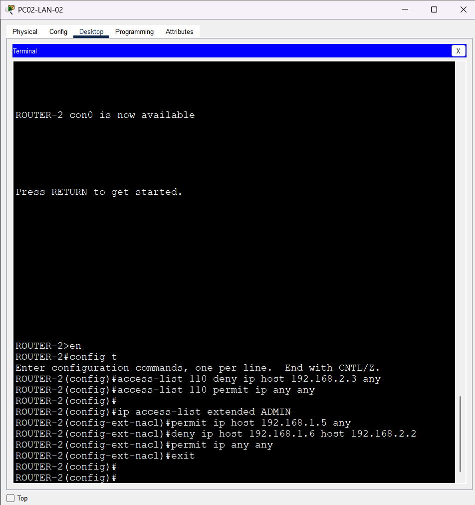
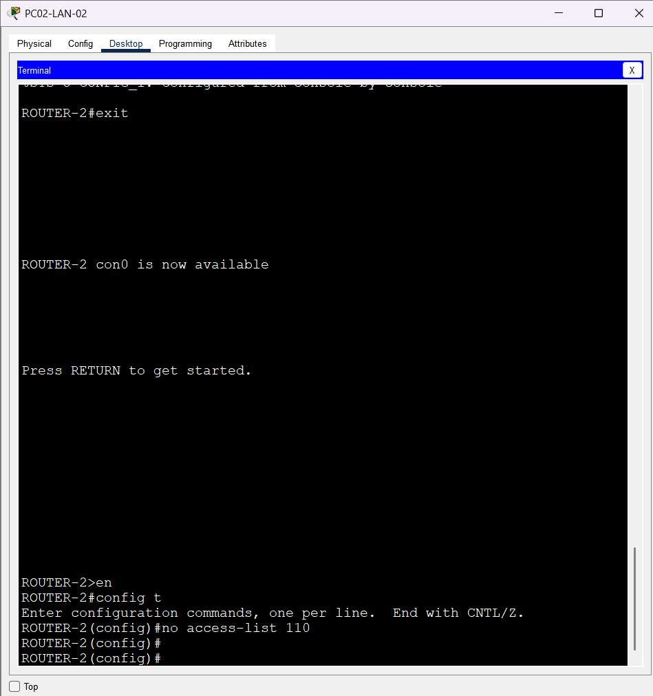
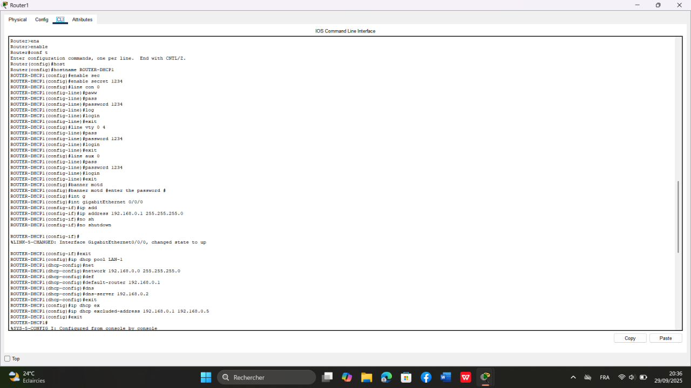
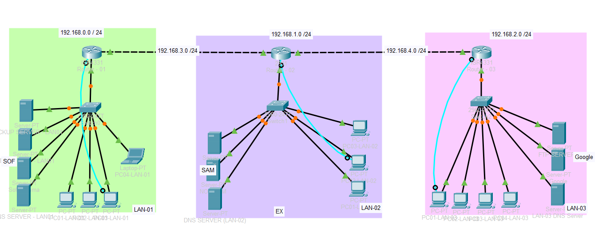
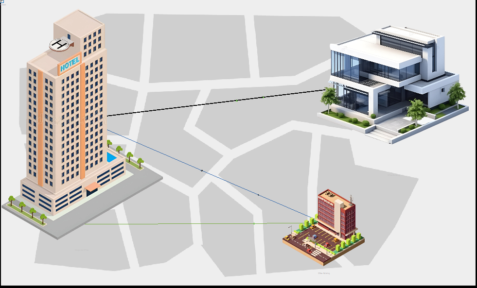

# ACL-Network-simulation-00
```markdown
This project demonstrates the implementation and management of Access Control Lists (ACLs) using Cisco Packet Tracer. The simulation includes logical and physical network topologies, router configuration, ACL creation and deletion, and traffic filtering between network segments. Screenshots are included to illustrate the configuration process and network behavior.
```

## Access Control Lists Simulation
```markdown
This project demenstrates the implementation of Access Control Lists(ACLs) using cisco packet tracer .
```
## Creation of the ACL
```markdown
Correct ordering of ACL entries (ACEs).
```
```markdown
Standard ACL numbered
```
```cisco
Router(config)# access-list 1 deny 192.168.1.10 0.0.0.0
Router(config)# access-list 1 permit any
Router(config)# interface fa0/0
Router(config-if)# ip access-group 1 in
```
```markdown
Extended ACL numbered
```

```markdown
Standard ACL named
```
```cisco
Router(config)# ip access-list standard BLOCK_PC
Router(config-std-nacl)# deny 192.168.1.10 0.0.0.0
Router(config-std-nacl)# permit any
Router(config)# interface fa0/0
Router(config-if)# ip access-group BLOCK_PC in
```
```markdown
Extended ACL named
```
```cisco
Router(config)# ip access-list extended BLOCK_HTTP
Router(config-ext-nacl)# deny tcp 192.168.1.0 0.0.0.255 any eq 80
Router(config-ext-nacl)# permit ip any any
Router(config)# interface fa0/1
Router(config-if)# ip access-group BLOCK_HTTP in
```
## Delete an ACL completely
```markdown
the process of deleting an ACL and its ACEs .
```
```markdown
Deleting an extended ACL numbered
```

```markdown
Deleting an standard ACL numbered
```
```cisco
Router(config)# no access-list 1
```
```markdown
Deleting an extended ACL named
```
```cisco
Router(config)# no ip access-list extended BLOCK_HTTP
```
```markdown
Deleting an standard ACL named
```
```cisco
Router(config)# no ip access-list standard BLOCK_PC
```
## Apply in the interface
```markdown
Apply numbered ACL standard/extended
```
```cisco
ip access-group 1 or 110 in
```
```markdown
Apply namaed ACL standard/extended
```
```cisco
ip access-group BLOCK_HTTP or BLOCK_PC in
```
## Delete from the interface 
```markdown
Delete an nubered ACL from an interface
```
```cisco
Router(config-if)# no ip access-group 1 or 110 in
```
```markdown
Delete an named ACL from an interface
```
```cisco
Router(config-if)# no ip access-group BLOCK_HTTP in
```
## Cnfiguration
```markdown
basic router configuration commands and router DHCP.
```

## Project picture
```markdown
logical topology of the project .
```

## Project picture
```markdown
physical topology of the project .
```

