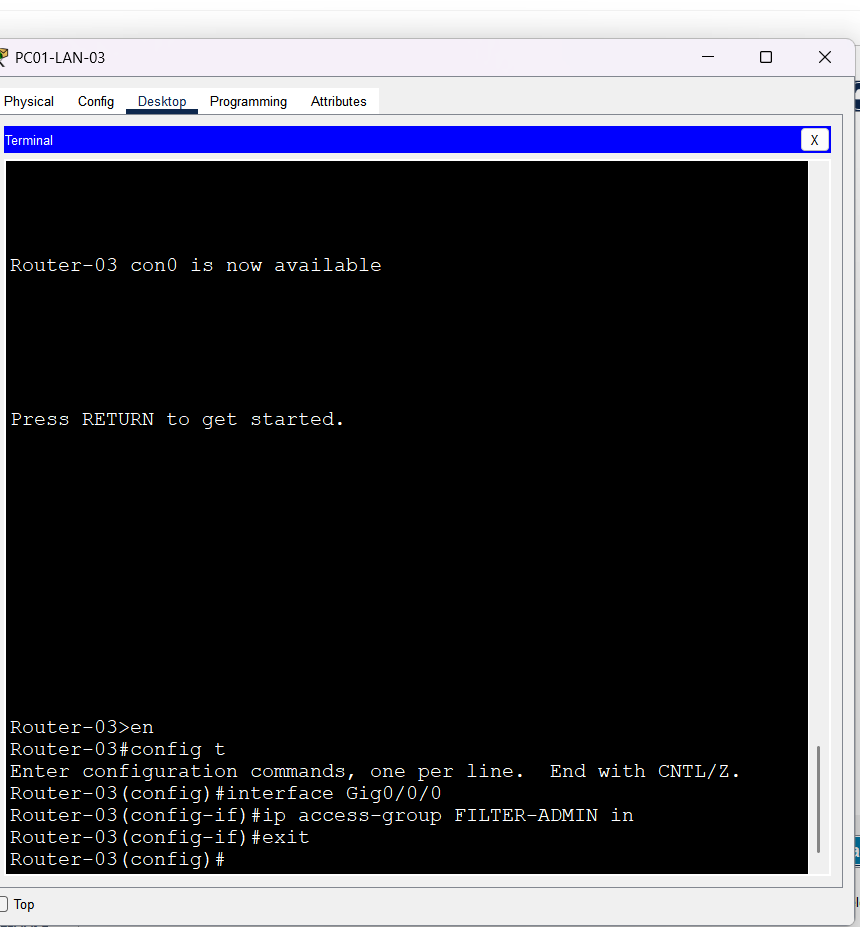

# ACL-Network-simulation-00
This project demonstrates the implementation and management of Access Control Lists (ACLs) using Cisco Packet Tracer. The simulation includes logical and physical network topologies, router configuration, ACL creation and deletion, and traffic filtering between network segments. Screenshots are included to illustrate the configuration process and network behavior.
## Access Control Lists Simulation
This project demenstrates the implementation of Access Control Lists(ACLs) using cisco packet tracer .
## Creation of the ACL
```markdown
Correct ordering of ACL entries (ACEs).

```cisco
Router(config)# access-list 1 deny 192.168.1.10 0.0.0.0
Router(config)# access-list 1 permit any
Router(config)# interface fa0/0
Router(config-if)# ip access-group 1 in```


## Delete an ACL 
the process of deleting an ACL and its ACEs .

## Apply in the interface
this picture shows the commands used to apply ACLs on the interface.

## Cnfiguration
basic router configuration commands and router DHCP.


## Project picture
logical topology of the project .

## Project picture
physical topology of the project .

